# Optimisation Pipeline Diagram

## Overview
This diagram illustrates the complete optimisation workflow for collared PPA parameter determination, from data inputs through iterative algorithm steps to final optimal solution.

```mermaid
flowchart TD
    %% Input Stage
    subgraph Input["Input Preparation"]
        A1[Hourly Spot Prices<br/>EUR/MWh, 96,170 hours]
        A2[Scaled Hourly Generation<br/>MWh, 50 MW asset]
    end
    
    %% Initialization Stage
    subgraph Init["Contract Parameter Initialisation"]
        B1[Optimiser Proposes<br/>Candidate Parameters]
        B2[Floor F, Strike K, Cap C]
        B3[Bounded by Domain:<br/>F ∈ max0, Q₁%‒Q₆₀%<br/>K ∈ Q₂₀%‒Q₈₀%<br/>C ∈ Q₄₀%‒Q₉₉%]
    end
    
    %% Simulation Stage
    subgraph Simulation["PPA Cash Flow Simulation"]
        C1[Compute Hourly PPA Revenues<br/>Based on Collared Structure]
        C2[Compute Market Baseline<br/>Revenues in Parallel]
    end
    
    %% Aggregation Stage
    subgraph Aggregation["Revenue Aggregation"]
        D1[Aggregate Hourly<br/>to Monthly Revenues]
        D2[Monthly Distribution<br/>for Risk Assessment<br/>132 months full period]
    end
    
    %% Metrics Stage
    subgraph Metrics["Risk Metric Computation"]
        E1[Expected Revenue<br/>𝔼R_PPA = Monthly Mean]
        E2[CVaR at q%<br/>Expected revenue in<br/>worst q% of months]
        E3[Net Transfer<br/>PPA revenues - Market revenues]
    end
    
    %% Objective Stage
    subgraph Objective["Objective Function Evaluation"]
        F1[Mean–CVaR Objective<br/>max 1-λ·𝔼R_PPA + λ·CVaR<br/>λ = 0.1 risk aversion]
        F2[Base Fitness Value]
    end
    
    %% Constraint Stage
    subgraph Constraints["Constraint Evaluation"]
        G1[Structural Constraints<br/>F ≤ K ≤ C<br/>Quantile bounds satisfied?]
        G2[Fairness Constraint<br/>net_transfer / market_baseline ≤ β<br/>β = 0.05 5% threshold]
    end
    
    %% Penalty Stage
    subgraph Penalty["Penalty Application"]
        H1{Soft Constraints<br/>Violated?}
        H2[Apply Penalties]
        H3[Penalised Fitness Value]
    end
    
    %% Update Stage
    subgraph Update["Optimiser Update Step"]
        I1[Algorithm Updates<br/>Search Strategy]
        I2[Propose New Candidate<br/>Parameters Based on Fitness]
    end
    
    %% Termination Stage
    subgraph Termination["Termination Check"]
        J1{Stopping Criteria<br/>Met?}
        J2[Max iterations reached OR<br/>Convergence threshold satisfied OR<br/>Callback indicates completion]
    end
    
    %% Output Stage
    subgraph Output["Final Output"]
        K1[Optimal Parameters<br/>F*, K*, C*]
        K2[Convergence History<br/>Fitness trajectory]
        K3[Search Log<br/>All evaluations]
        K4[Risk Metrics<br/>Mean, CVaR, Sharpe, etc.]
    end
    
    %% Flow connections
    A1 --> Simulation
    A2 --> Simulation
    
    B1 --> B2
    B2 --> B3
    B3 --> Simulation
    
    C1 --> Aggregation
    C2 --> Aggregation
    
    D1 --> D2
    D2 --> Metrics
    
    E1 --> Objective
    E2 --> Objective
    E3 --> Constraints
    
    F1 --> F2
    F2 --> Constraints
    
    G1 --> H1
    G2 --> H1
    
    H1 -->|Yes| H2
    H1 -->|No| H3
    H2 --> H3
    
    H3 --> J1
    
    J1 -->|No| I1
    I1 --> I2
    I2 --> Init
    
    J1 -->|Yes| Output
    
    K1 -.-> K2
    K2 -.-> K3
    K3 -.-> K4
    
    %% Styling - High contrast colors
    classDef inputStyle fill:#cce5ff,stroke:#003d7a,stroke-width:3px,color:#000
    classDef processStyle fill:#ffe6b3,stroke:#b35f00,stroke-width:3px,color:#000
    classDef decisionStyle fill:#ffcccc,stroke:#8b0000,stroke-width:3px,color:#000
    classDef outputStyle fill:#c8e6c9,stroke:#1b5e20,stroke-width:3px,color:#000
    
    class Input,Init inputStyle
    class Simulation,Aggregation,Metrics,Objective,Constraints,Penalty,Update processStyle
    class Termination decisionStyle
    class Output outputStyle
```

## Pipeline Stages

### 1. Input Preparation
- **Hourly spot prices**: Spanish MIBEL day-ahead prices (EUR/MWh)
- **Scaled generation profiles**: 50 MW solar asset, hourly granularity
- **Duration**: 96,170 hours (2015-2025)

### 2. Contract Parameter Initialisation
- Optimiser proposes candidate Floor (F), Strike (K), Cap (C) values
- Parameters bounded by quantile-based domain constraints:
  - Floor: max(0, Q₁%) ≤ F ≤ Q₆₀%
  - Strike: Q₂₀% ≤ K ≤ Q₈₀%
  - Cap: Q₄₀% ≤ C ≤ Q₉₉%

### 3. PPA Cash Flow Simulation
- Hourly PPA revenues computed based on collared contract structure
- Market baseline revenues (spot settlement) computed in parallel
- Both used for fairness constraint evaluation

### 4. Revenue Aggregation
- Hourly revenues summed to monthly totals
- Monthly distribution provides risk assessment basis
- 132 months (full period) or 84/36 months (train/test)

### 5. Risk Metric Computation
- **Expected revenue**: 𝔼[R_PPA] = mean of monthly revenues
- **CVaR**: Expected revenue in worst q% of months (q=5%, so worst ~7 months)
- **Net transfer**: Sum of (PPA revenues - Market revenues) for fairness constraint

### 6. Objective Function Evaluation
- Base objective: max (1-λ)·𝔼[R_PPA] + λ·CVaR
- λ = 0.1 (10% weight on CVaR, 90% on mean)
- Equivalent to minimizing shortfall: max 𝔼[R_PPA] - λ·(𝔼[R_PPA] - CVaR)

### 7. Constraint Evaluation
- **Structural constraints**: F ≤ K ≤ C and quantile bounds
- **Fairness constraint**: net_transfer / market_baseline ≤ β (β = 0.05 or 5%)

### 8. Penalty Application
- Soft constraint violations trigger penalties:
  - Structural violation: 1×10⁸ EUR fixed penalty
  - Fairness violation: 10× multiplier on EUR-scaled breach
    - Calculation: (violation_fraction × market_baseline) × 10
    - Example: 3% breach on 1M EUR baseline = (0.03 × 1,000,000) × 10 = 300,000 EUR penalty
- Penalised fitness guides search away from infeasible regions

### 9. Optimiser Update Step
- Algorithm updates internal state based on fitness landscape
- Proposes new candidate parameters:
  - **Differential Evolution**: Population-based mutation and crossover
  - **Dual Annealing**: Temperature-controlled random walks
  - **SHGO**: Simplicial homology-based exploration

### 10. Termination and Output
- Stopping criteria:
  - Maximum iterations reached (varies by algorithm)
  - Convergence threshold satisfied (fitness improvement < tolerance)
  - Callback function indicates completion
- Outputs:
  - Optimal parameters (F*, K*, C*)
  - Convergence history (fitness trajectory)
  - Search log (all evaluated candidates)
  - Risk metrics and constraint satisfaction status

## Implementation Notes

- **Penalty method**: Soft constraints use large penalties to approximate hard constraints
- **Quantile bounds**: Hard constraints enforced by scipy's bounded optimizer interface
- **Parallel computation**: Market baseline computed once, reused for fairness evaluation
- **Monthly aggregation**: Reduces noise, aligns with typical PPA settlement periods
- **Risk aversion**: λ=0.1 represents generator with modest tail risk sensitivity

## Related Files

- Pipeline implementation: [`src/ppa_optimiser.py`](../src/ppa_optimiser.py)
- Objective function: [`src/optimisation_problem.py`](../src/optimisation_problem.py)
- Risk metrics: [`src/ppa_risk_metrics.py`](../src/ppa_risk_metrics.py)
- Execution script: [`run_optimisation.py`](../run_optimisation.py)
